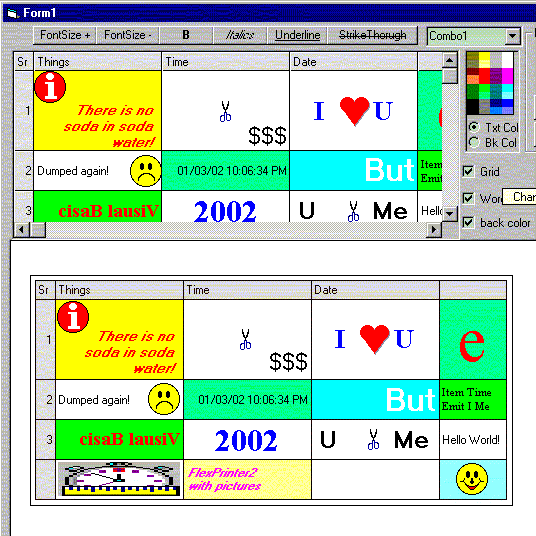



## FlexPrinter2 with Pictures

### Description

Prints the contents of MSHFlexGrid control. This one prints

pictures in all alignments. Have a look.
 
### More Info
 

             |
---                |---
**Submitted On**   |2002-09-27 13:43:02
**By**             |[Opal Raj Ghimire](https://github.com/Planet-Source-Code/PSCIndex/blob/master/ByAuthor/opal-raj-ghimire.md)
**Level**          |Intermediate
**User Rating**    |4.9 (79 globes from 16 users)
**Compatibility**  |VB 5\.0, VB 6\.0
**Category**       |[Miscellaneous](https://github.com/Planet-Source-Code/PSCIndex/blob/master/ByCategory/miscellaneous__1-1.md)
**World**          |[Visual Basic](https://github.com/Planet-Source-Code/PSCIndex/blob/master/ByWorld/visual-basic.md)
**Archive File**   |[FlexPrinte1372159272002\.zip](https://github.com/Planet-Source-Code/opal-raj-ghimire-flexprinter2-with-pictures__1-30406/archive/master.zip)

